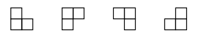

# tabuleiro-L
Em um tabuleiro quadrado dividido em $2^{(2n)}$ quadrados (com tamanhos iguais entre si), cada posição (i.e., cada quadrado da divisão) pode ser determinada por uma tupla de comprimento $n$, onde cada elemento é um inteiro $0$, $1$, $2$ ou $3$, denotando sucessivamente em quais quadrantes do tabuleiro o quadrado se encontra: convencionando que $0$ denota o quadrante superior esquerdo, $1$ o superior direito, $2$ o inferior esquerdo e $3$ o inferior direito.

* o primeiro número da posição denota em qual quadrante do tabuleiro inteiro o quadrado em questão se encontra,
* o segundo número da posição denota em qual sub-quadrante deste primeiro quadrante o quadrado em questão se encontra,

e assim sucessivamente. No tabuleiro de tamanho $n=1$, a única posição existente é a tupla vazia ( ).

Também podemos determinar onde se localiza no tabuleiro uma peça de 3 quadrados em formato “L”, como na figura abaixo, usando um conjunto contendo as posições dos 3 quadrados do tabuleiro cobertos pela peça.

Por exemplo, na figura abaixo temos um tabuleiro dividido em $2^8$ quadrados com a posição $(1, 3, 2, 2)$ marcada de preto e duas peças em “L”, verde e azul, localizadas em $\{ (0, 2, 2, 2), (0, 2, 2, 3), (2, 0, 0, 1) \}$ e $\{(3, 2, 0, 3), (3, 2, 1, 2), (3, 2, 2, 1)\}$ respectivamente (as linhas tracejadas são apenas para facilitar a visualização).

 1. Faça uma função que receba uma posição de um tabuleiro qualquer e uma lista de localizações de peças em “L” neste mesmo tabuleiro (você não precisa verificar se a entrada cumpre esta especificação), e retorne `True` caso as peças nestas localizações cubram completamente o tabuleiro exceto pela posição dada, `False` em caso contrário.
 2. Faça uma função recursiva que receba uma posição de um tabuleiro qualquer (novamente, você não precisa verificar se a entrada cumpre esta especificação) e retorne uma lista de localizações de peças em “L” neste mesmo tabuleiro que o cubram completamente exceto pela posição dada. (Dica: faça 4 chamadas recursivas.)
